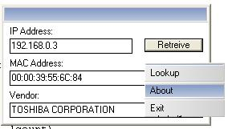



## MAC Address Look\-up \(with DB\)

### Description

This code will show you how to lookup a MAC address via its IP. It also has a 1500+ database of vendors and will match it with the MAC adress Instantly. Also Because It looked a bit empty I threw in a skined titlebar example and my cusom menu as well. Dont ask me why. Anyways please Vote and leave comments
 
### More Info
 

             |
---                |---
**Submitted On**   |2003-03-02 01:56:30
**By**             |[�e7eN](https://github.com/Planet-Source-Code/PSCIndex/blob/master/ByAuthor/e7en.md)
**Level**          |Beginner
**User Rating**    |4.7 (28 globes from 6 users)
**Compatibility**  |VB 5\.0, VB 6\.0
**Category**       |[Miscellaneous](https://github.com/Planet-Source-Code/PSCIndex/blob/master/ByCategory/miscellaneous__1-1.md)
**World**          |[Visual Basic](https://github.com/Planet-Source-Code/PSCIndex/blob/master/ByWorld/visual-basic.md)
**Archive File**   |[MAC\_Addres1564593252003\.zip](https://github.com/Planet-Source-Code/e7en-mac-address-look-up-with-db__1-44261/archive/master.zip)

